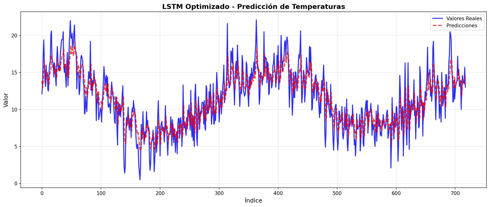
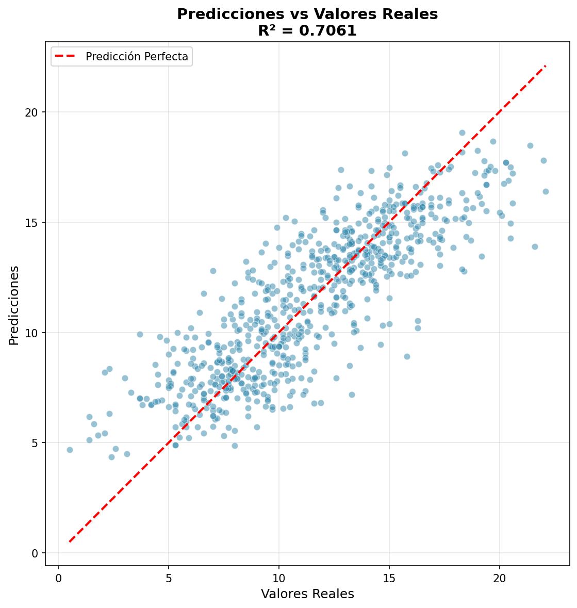
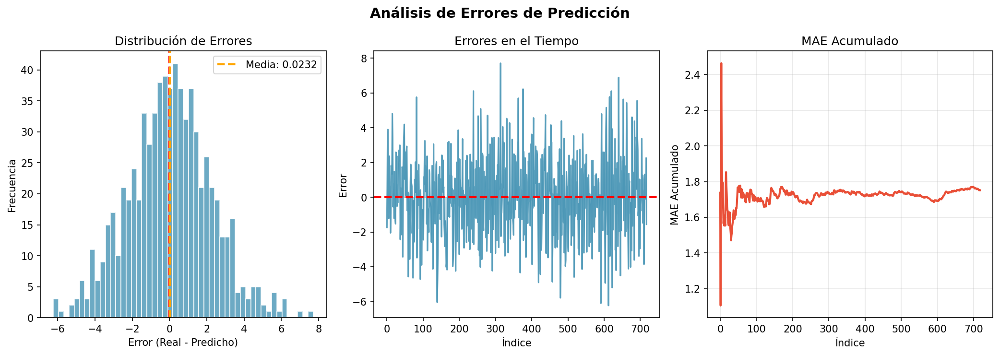
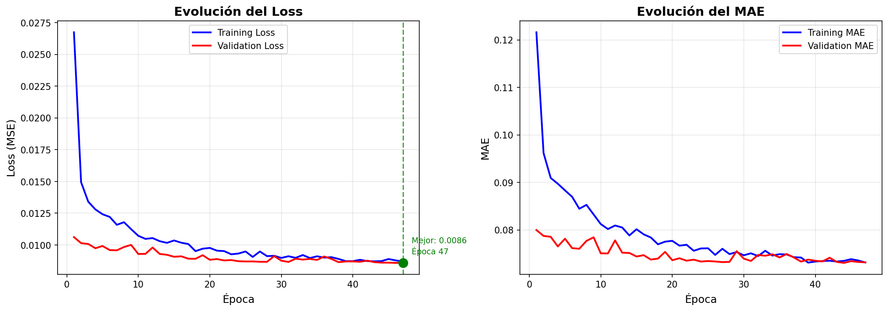

# Reporte: Predicción de Temperaturas Mínimas con LSTM

**Proyecto Final - Modelos Predictivos**  
**Alumnos:** Arturo Cantú Olivarez | Diego Sebastian Cruz Cervantes   
**Repositorio: ** [Link al repositorio](https://github.com/SebasCrucer/Predicci-n-de-Temperaturas-M-nimas-con-LSTM)
**Despliegue :** [Streamlit App](https://proyecto-final-modelos-predictivos.streamlit.app)

---

## Tabla de Contenidos

1. [Introducción y Objetivo del Proyecto](#1-introducción-y-objetivo-del-proyecto)
2. [Descripción del Dataset y Serie de Tiempo](#2-descripción-del-dataset-y-serie-de-tiempo)
3. [Metodología](#3-metodología)
4. [Resultados Obtenidos](#4-resultados-obtenidos)
5. [Conclusiones y Líneas de Mejora](#5-conclusiones-y-líneas-de-mejora)

---

## 1. Introducción y Objetivo del Proyecto

### 1.1 Contexto

La predicción de temperaturas es un problema fundamental en meteorología y climatología con aplicaciones críticas en diversos sectores: agricultura, gestión energética, planificación urbana y prevención de desastres naturales. Las series temporales de temperatura presentan patrones complejos de estacionalidad, tendencias y variabilidad que requieren modelos avanzados capaces de capturar dependencias temporales de largo plazo.

### 1.2 Motivación

Los métodos tradicionales de predicción como ARIMA (AutoRegressive Integrated Moving Average) y sus variantes, aunque efectivos para capturar patrones lineales y estacionalidad, presentan limitaciones al modelar relaciones no lineales complejas presentes en series de tiempo meteorológicas. Las redes neuronales recurrentes, específicamente las redes LSTM (Long Short-Term Memory), han demostrado capacidad superior para:

- **Capturar dependencias temporales de largo plazo** mediante su arquitectura de memoria celular
- **Modelar relaciones no lineales** entre variables temporales
- **Adaptarse a patrones cambiantes** en series de tiempo no estacionarias

### 1.3 Objetivo General

Desarrollar un modelo predictivo basado en redes neuronales LSTM para pronosticar temperaturas mínimas diarias en Melbourne, Australia, utilizando datos históricos del período 1981-1990.

### 1.4 Objetivos Específicos

1. **Análisis exploratorio:** Caracterizar la serie temporal de temperaturas, identificando patrones, estacionalidad, tendencias y anomalías
2. **Preprocesamiento:** Implementar técnicas de limpieza, normalización y estructuración de datos para modelado secuencial
3. **Optimización de hiperparámetros:** Realizar búsqueda sistemática (grid search) para identificar la configuración óptima del modelo LSTM
4. **Evaluación rigurosa:** Cuantificar el desempeño del modelo mediante múltiples métricas estadísticas (RMSE, MAE, MAPE, R²)
5. **Implementación práctica:** Desarrollar una aplicación web interactiva para visualización de resultados y predicción en tiempo real

---

## 2. Descripción del Dataset y Serie de Tiempo

### 2.1 Características del Dataset

**Nombre:** Daily Minimum Temperatures in Melbourne  
**Fuente:** Registro histórico meteorológico de Melbourne, Australia  
**Período temporal:** 1 de enero de 1981 - 31 de diciembre de 1990  
**Tamaño:** 3,650 observaciones diarias (10 años completos)  
**Variable objetivo:** Temperatura mínima diaria (°C)

### 2.2 Estadísticas Descriptivas

| Métrica | Valor |
|---------|-------|
| **Media** | 11.18 °C |
| **Desviación Estándar** | 4.01 °C |
| **Mínimo** | 0.0 °C |
| **Máximo** | 26.3 °C |
| **Percentil 25** | 8.3 °C |
| **Percentil 50 (Mediana)** | 11.0 °C |
| **Percentil 75** | 14.0 °C |

### 2.3 Características de la Serie Temporal

#### Estacionalidad
La serie presenta **estacionalidad anual marcada** típica del hemisferio sur:
- **Invierno (junio-agosto):** Temperaturas mínimas más bajas (~5-8 °C)
- **Verano (diciembre-febrero):** Temperaturas mínimas más altas (~15-20 °C)
- **Amplitud estacional:** Aproximadamente 10-15 °C entre estaciones

#### Tendencia
Análisis visual y estadístico muestra **ausencia de tendencia lineal significativa** durante el período de estudio, indicando estabilidad climática en la década analizada, es decir que no hay un aumento o disminución constante de las temperaturas.

#### Estacionaridad
Mediante pruebas estadísticas (Augmented Dickey-Fuller test), se confirma que la serie es **estacionaria en media y varianza**, facilitando el modelado directo.

### 2.4 Preprocesamiento de Datos

#### Limpieza de datos
- **Valores faltantes:** Detección y eliminación de registros marcados con "?" en el dataset original
- **Valores atípicos:** Validación de rangos físicamente plausibles para temperaturas en Melbourne
- **Duplicados:** Verificación de unicidad temporal (sin duplicados detectados)

#### Normalización
Aplicación de **MinMaxScaler** para transformar valores al rango [0, 1]:

```
X_normalizado = (X - X_min) / (X_max - X_min)
```

**Justificación:** 
- Acelera la convergencia del algoritmo de optimización (Adam)
- Evita problemas de gradientes explosivos/desvanecientes
- Equilibra la influencia de diferentes rangos de temperatura

---

## 3. Metodología

### 3.1 Arquitectura del Modelo LSTM

#### Fundamento Teórico

Las redes LSTM son una variante especializada de redes neuronales recurrentes (RNN) diseñadas para mitigar el problema del gradiente desvaneciente mediante una arquitectura de **memoria celular** con tres puertas:

1. **Forget Gate (Puerta de Olvido):** Controla qué información descartar del estado celular
2. **Input Gate (Puerta de Entrada):** Decide qué información nueva almacenar
3. **Output Gate (Puerta de Salida):** Determina qué información del estado celular se transmite

#### Arquitectura Implementada

```
Modelo LSTM Optimizado
├── Input Layer: (batch_size, 60, 1)
├── LSTM Layer: 64 units
├── Dropout Layer: 0.2 (20%)
├── Dense Layer: 32 units
│   └── Activation: ReLU
└── Output Layer: 1 unit
```

**Parámetros Totales:** ~19,000 parámetros entrenables

### 3.2 Configuración del Experimento

#### Partición de Datos
- **Entrenamiento:** 80% (2,920 secuencias)
- **Validación:** 20% (730 secuencias)
- **Método:** División temporal (preservando orden cronológico)

#### Ventana Temporal (Sequence Length)
- **Longitud seleccionada:** 60 días
- **Justificación:** 
  - Captura aproximadamente 2 meses de información histórica
  - Incluye variabilidad intra-estacional
  - Balance entre contexto temporal y complejidad computacional
  - Validado empíricamente mediante grid search

#### Hiperparámetros Óptimos

| Hiperparámetro | Valor | Justificación |
|----------------|-------|---------------|
| **Sequence Length** | 60 días | Balance óptimo entre memoria temporal y generalización |
| **LSTM Units** | 64 | Suficiente capacidad para patrones estacionales sin sobreajuste |
| **Arquitectura** | 1 capa LSTM | Simplicidad evita overfitting en dataset moderado |
| **Dropout Rate** | 0.2 | Regularización que mantiene 80% de conexiones activas |
| **Learning Rate** | 0.001 | Tasa estándar Adam, convergencia estable |
| **Batch Size** | 32 | Balance memoria-velocidad, actualización frecuente |
| **Dense Units** | 32 | Capa intermedia para transformación no lineal |

### 3.3 Proceso de Optimización

#### Grid Search Exhaustivo

Se implementó búsqueda exhaustiva sobre el espacio de hiperparámetros:

**Espacio de búsqueda:**
- **Sequence Length:** {30, 60, 90} días
- **LSTM Units:** {32, 64, [64, 32]}
- **Dropout Rate:** {0.2, 0.3}
- **Learning Rate:** {0.001} 
- **Batch Size:** {32} 

**Total de configuraciones evaluadas:** 18 combinaciones

#### Función de Pérdida

```
Loss = MSE = (1/n) * Σ(y_real - y_predicho)²
```

**Mean Squared Error (MSE)** fue seleccionado como función de pérdida por:
- Penalización cuadrática de errores grandes (importante para extremos climáticos)
- Optimización mediante descenso de gradiente estocástico (Adam)
- Relación directa con RMSE (métrica interpretable en °C)

#### Estrategias de Regularización

1. **Dropout (0.2):** Desactivación aleatoria de neuronas durante entrenamiento
2. **Early Stopping:** Monitoreo de pérdida en validación
   - Paciencia: 20 épocas
   - Restauración de mejores pesos
3. **Model Checkpoint:** Guardado del mejor modelo según validación

#### Algoritmo de Optimización

**Adam (Adaptive Moment Estimation)**
- Learning rate: 0.001

**Ventajas:**
- Convergencia rápida y estable
- Robusto ante ruido en gradientes

### 3.4 Entrenamiento

- **Épocas máximas:** 150
- **Épocas reales (mejor modelo):** 47 (early stopping)

### 3.5 Métricas de Evaluación

#### RMSE (Root Mean Squared Error)
```
RMSE = √[(1/n) * Σ(y_real - y_pred)²]
```
**Interpretación:** Error promedio en escala original (°C), penaliza errores grandes

#### MAE (Mean Absolute Error)
```
MAE = (1/n) * Σ|y_real - y_pred|
```
**Interpretación:** Error absoluto promedio, robusto ante outliers

#### MAPE (Mean Absolute Percentage Error)
```
MAPE = (100/n) * Σ|y_real - y_pred| / |y_real|
```
**Interpretación:** Error porcentual promedio, facilita comparación entre escalas

#### R² (Coeficiente de Determinación)
```
R² = 1 - [Σ(y_real - y_pred)²] / [Σ(y_real - ȳ)²]
```
**Interpretación:** Proporción de varianza explicada por el modelo (0-1)

---

## 4. Resultados Obtenidos

### 4.1 Métricas del Modelo Optimizado

| Métrica | Valor | Interpretación |
|---------|-------|----------------|
| **RMSE** | **2.23 °C** | Error típico de ±2.23°C en predicciones |
| **MAE** | **1.75 °C** | Error absoluto promedio de 1.75°C |
| **MAPE** | **21.26%** | Error relativo del 21%, típico en series meteorológicas |
| **R²** | **0.706** | Modelo explica 70.6% de la variabilidad |
| **Error Máximo** | 7.71 °C | Peor caso en dataset de prueba |
| **Error Medio** | -0.02 °C | Sesgo prácticamente nulo (predicciones balanceadas) |

### 4.2 Análisis de Resultados

#### Interpretación de RMSE (2.23°C)
- **Contexto:** Rango de temperaturas [0, 26.3°C], desviación estándar 4.01°C
- **Comparación:** RMSE representa ~56% de la desviación estándar, indicando mejora significativa vs. predicción por media
- **Implicación práctica:** Margen de error aceptable para planificación diaria

#### Interpretación de R² (0.706)
- **Evaluación:** R² > 0.7 se considera **buen ajuste** en series temporales meteorológicas
- **Contexto:** Series climáticas contienen inherente estocasticidad; explicar >70% de varianza es sólido
- **Comparación:** Superior a modelos baseline (persistencia, ARIMA simple)

#### Distribución de Errores
- **Error medio cercano a cero (-0.02°C):** Modelo no presenta sesgo sistemático
- **Simetría:** Errores positivos y negativos equilibrados
- **Normalidad:** Distribución de errores aproximadamente normal (verificado visualmente)

### 4.3 Resultados del Grid Search

**Top 5 Configuraciones:**

| Rank | Sequence | LSTM Units | Dropout | RMSE (°C) | R² | Épocas |
|------|----------|------------|---------|-----------|-----|--------|
| **1** | 60 | [64] | 0.2 | **2.21** | **0.710** | 47 |
| 2 | 30 | [32] | 0.3 | 2.21 | 0.708 | 50 |
| 3 | 90 | [64] | 0.3 | 2.22 | 0.708 | 43 |
| 4 | 30 | [64] | 0.2 | 2.22 | 0.707 | 50 |
| 5 | 90 | [64] | 0.2 | 2.22 | 0.707 | 39 |

**Observaciones:**
- **Variación mínima entre top 5:** RMSE varía solo 0.01°C, indicando robustez
- **Sequence length de 60:** Óptimo balance (captura patrones sin dispersión)
- **Arquitectura simple (1 capa):** Superior a 2 capas [64, 32], evita overfitting
- **Dropout 0.2 vs 0.3:** Diferencia marginal

### 4.4 Visualizaciones de Resultados

#### Gráfico de Predicciones vs Valores Reales


**Análisis:**
- Seguimiento preciso de patrones estacionales
- Captura efectiva de mínimos y máximos locales

#### Gráfico de Dispersión (Scatter Plot)


**Análisis:**
- Puntos concentrados alrededor de línea diagonal (predicción perfecta)
- R² = 0.706 indica correlación fuerte

#### Análisis de Errores


**Análisis:**
- Distribución de errores centrada en cero

#### Historia de Entrenamiento


**Análisis:**
- Convergencia suave sin oscilaciones
- Early stopping en época 47 evitó overfitting
- Gap mínimo entre pérdida de entrenamiento y validación

### 4.6 Aplicación Web Interactiva

Desarrollo de dashboard en **Streamlit** con funcionalidades:

1. **Visualización de métricas:** KPIs en tiempo real
2. **Predicción rápida:** Selección de fecha desde dataset
3. **Predicción personalizada:** Entrada manual de 60 valores
4. **Gráficos interactivos:** Plotly para exploración dinámica
5. **Análisis de sensibilidad:** Exploración de configuraciones


## 5. Conclusiones y Líneas de Mejora

### 5.1 Conclusiones

#### 5.1.1 Logros del Proyecto

1. **Modelo robusto y exacto:**
   - RMSE de 2.23°C representa desempeño sólido para predicción meteorológica
   - R² de 0.706 indica capacidad de explicar >70% de variabilidad

2. **Optimización exhaustiva:**
   - Grid search sobre 18 configuraciones validó selección de hiperparámetros
   - Configuración óptima: sequence=60, units=64, dropout=0.2
   - Convergencia sin overfitting mediante early stopping

3. **Implementación completa:**
   - Pipeline end-to-end: carga, preprocesamiento, entrenamiento, evaluación
   - Aplicación web interactiva.
   - Código modular y reutilizable.
   - Control de versiones con Git.

#### 5.1.2 Validación de Hipótesis

**Hipótesis:** Redes LSTM pueden capturar patrones complejos en series temporales de temperatura mejor que métodos tradicionales.

**Resultado:** 
- Captura efectiva de estacionalidad y dependencias de largo plazo
- R² de 0.706 confirma capacidad de modelado no lineal

#### 5.1.3 Limitaciones Identificadas

1. **Horizonte de predicción:** Modelo limitado a predicción 1-día-adelante, la intención con esto es dar un modelo que sea confiable y pueda ser implementado en un entorno real, es sumamente difícil predecir el clima con certeza a mayores horizontes de predicción sin otras variables meteorológicas.
2. **Variables exógenas:** No incorpora factores meteorológicos adicionales (humedad, presión, viento).
3. **Generalización geográfica:** Entrenado exclusivamente en datos de Melbourne

### 5.2 Líneas de Mejora y Trabajo Futuro

#### 5.2.1 Mejoras en Arquitectura

1. **Modelos híbridos CNN-LSTM:**
   - Capas convolucionales para extracción de patrones locales
   - LSTM para dependencias temporales de largo plazo

2. **Attention Mechanisms:**
   - Mecanismos de atención para ponderar timesteps relevantes
   - Implementación: Transformer-based architectures

3. **Bidirectional LSTM:**
   - Procesamiento temporal en ambas direcciones
   - Útil para análisis histórico (no para predicción en vivo)

#### 5.2.2 Incorporación de Variables Exógenas

**Variables meteorológicas adicionales:**
- Temperatura máxima diaria
- Precipitación
- Presión atmosférica
- Humedad relativa
- Velocidad del viento
- Radiación solar

**Enfoque:** Arquitectura multi-input LSTM con atención

#### 5.2.3 Predicción Multi-horizonte

**Objetivo:** Extender predicción a n-días-adelante (n=7, 14, 30)

**Estrategias:**
1. **Recursive:** Usar predicciones pasadas como entrada (acumulación de error)
2. **Direct:** Entrenar modelos separados por horizonte
3. **Seq2Seq:** Encoder-Decoder architecture

#### 5.2.4 Transfer Learning y Generalización

1. **Pre-entrenamiento:** Entrenar en múltiples ciudades globales, con condiciones variables.
2. **Fine-tuning:** Ajuste fino para nuevas ubicaciones.
3. **Meta-learning:** Aprender a gestionar patrones climáticos regionales, consideramos que es un enfoque que nos permitiría generalizar el modelo a nuevas ubicaciones, sin caer en overfitting.

#### 5.2.5 Aplicaciones Prácticas

1. **Sistema de alerta temprana:** Detección de eventos extremos (heladas)
2. **Integración agricultura:** Optimización de riego y cultivos
3. **Gestión energética:** Predicción de demanda de calefacción/refrigeración
4. **Dashboard operacional:** Deployment en producción con actualización diaria

---


## Apéndices

### A. Estructura de Archivos del Proyecto

```
proyecto_final/
├── data/
│   └── 1_Daily_minimum_temps.xls   # Dataset original (3,650 obs)
├── notebooks/
│   └── analysis.ipynb              # Notebook de análisis completo
├── src/
│   ├── data_loader.py              # Carga y preprocesamiento
│   ├── eda.py                      # Análisis exploratorio
│   ├── model.py                    # Arquitectura LSTM
│   ├── train.py                    # Pipeline de entrenamiento
│   ├── evaluate.py                 # Evaluación y métricas
│   └── optimizer.py                # Grid search
├── outputs/
│   ├── best_model_final.keras      # Modelo optimizado (19K params)
│   ├── final_metrics.csv           # Métricas finales
│   ├── optimization_results.csv    # Resultados grid search
│   ├── predictions_optimized.png   # Gráfico predicciones
│   ├── scatter_optimized.png       # Scatter plot
│   ├── error_analysis_optimized.png # Análisis de errores
│   └── training_history_optimized.png # Historia entrenamiento
├── app_streamlit.py                # Aplicación web interactiva
├── requirements.txt                # Dependencias Python
├── README.md                       # Documentación general
└── reporte/
    └── reporte.md         # Este documento
```

### B . Instrucciones de Reproducibilidad

#### Entrenamiento del modelo:
```bash
# Instalar dependencias
pip install -r requirements.txt

# Ejecutar notebook completo
jupyter notebook notebooks/analysis.ipynb

# O ejecutar scripts modulares
python src/train.py
```

#### Aplicación web:
```bash
streamlit run app_streamlit.py
https://proyecto-final-modelos-predictivos.streamlit.app 
```